# Hostel-Complaint-Management-System

## Objective
The Hostel Complaint Management System seeks to facilitate seamless complaint submission and resolution, enhancing communication between hostel residents and authorities.

## Features
- **User-friendly Interface**: Simple and intuitive design for easy grievance submission by residents.
- **Real-time Updates**: Residents receive real-time updates on the status of their submitted grievances.
- **Admin Dashboard**: An administrative dashboard to manage grievances effectively.

## Technology Stack
- **Front-end**: HTML, CSS, JS
- **Framework**: Django
- **Back-end**: MySQL

## Functionalities
- Login: Students/staff
- Lodge complaints: Students can lodge complaints according to categories (Electricity, Gyser, LAN, Plumbing etc.)
- Complaint redressal: Staff can resolve and update complaint status.

## Schema Diagram
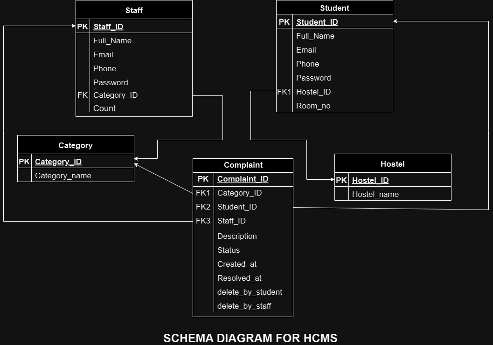

## Project Preview
**Homepage:**
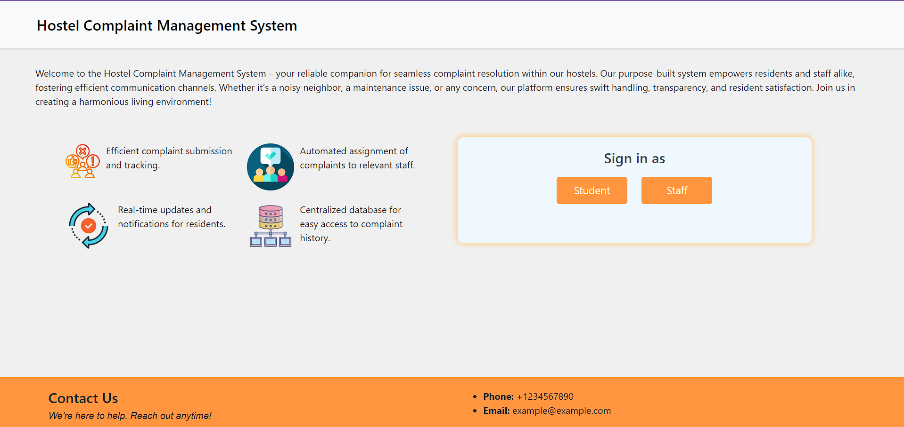

**Student Login:**
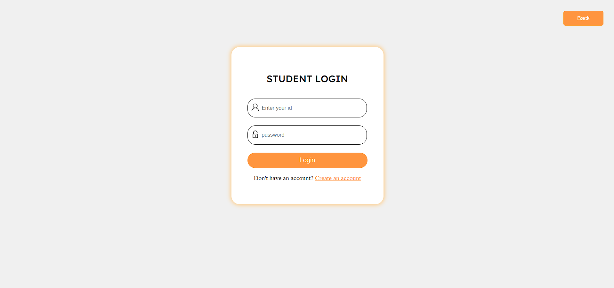

**Student Signup:**
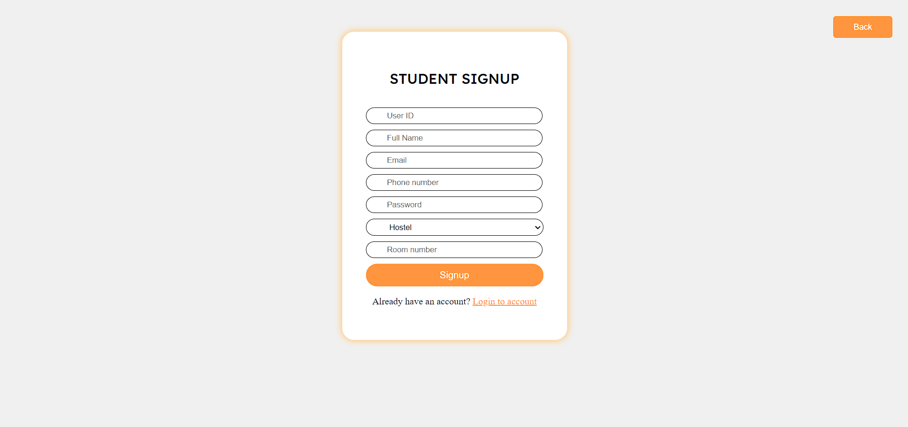

**Student Dashboard:** (when no complaints are registered)
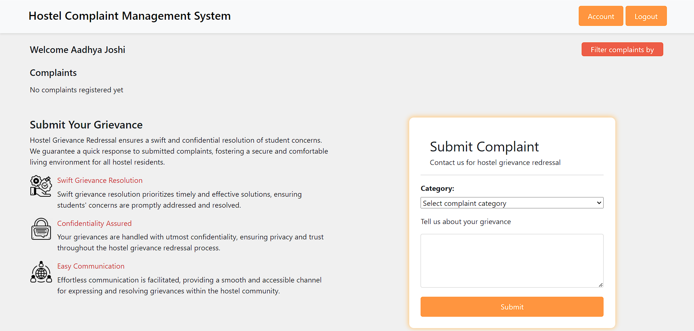

**Submitting Complaint:**

  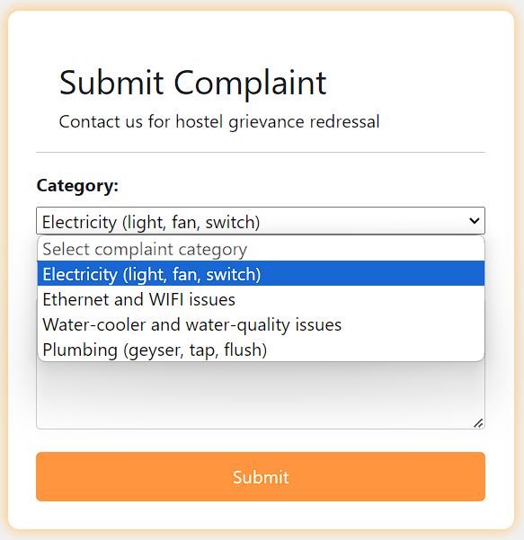
  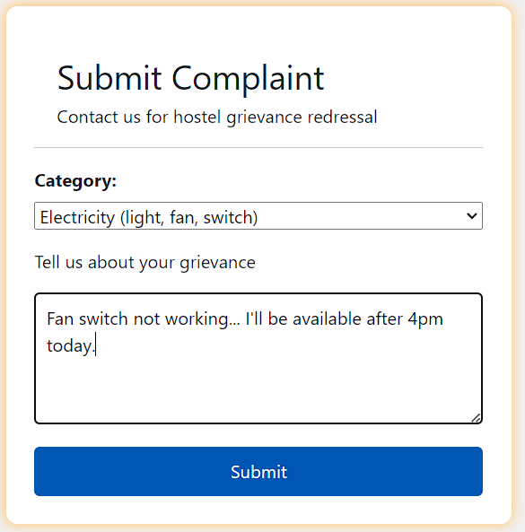 

  

**Student Dashboard:**(After submitting comaplint)
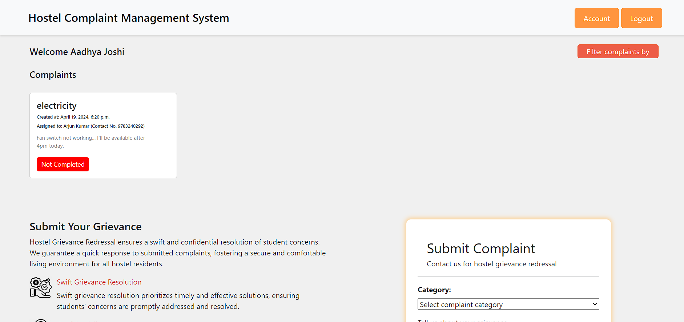

**Option for filtering Complaints:**
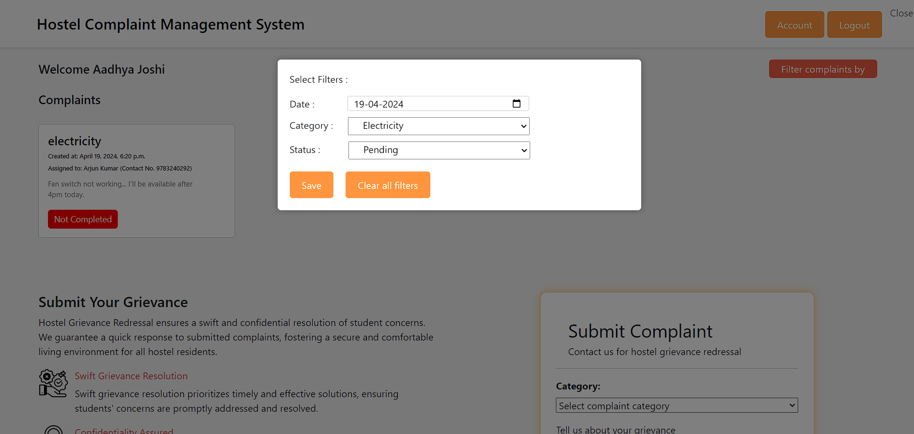

**Student profile:**
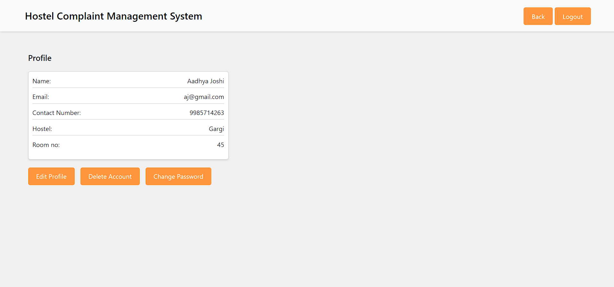

**Edit profile:**
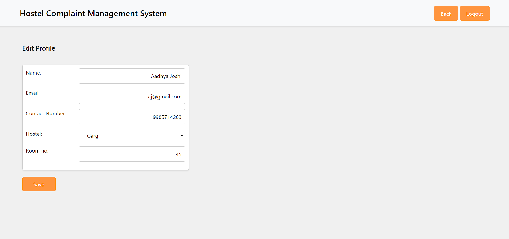

**Change Password:**
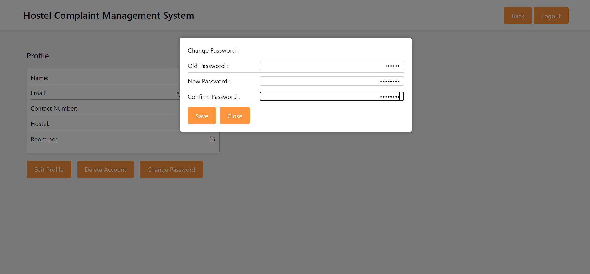

**Staff login:**
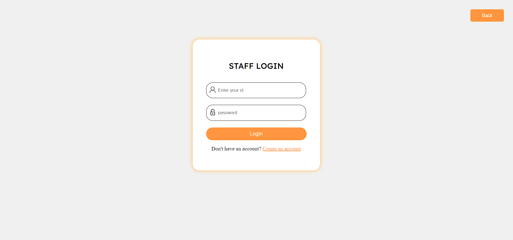

**Staff Signup:**
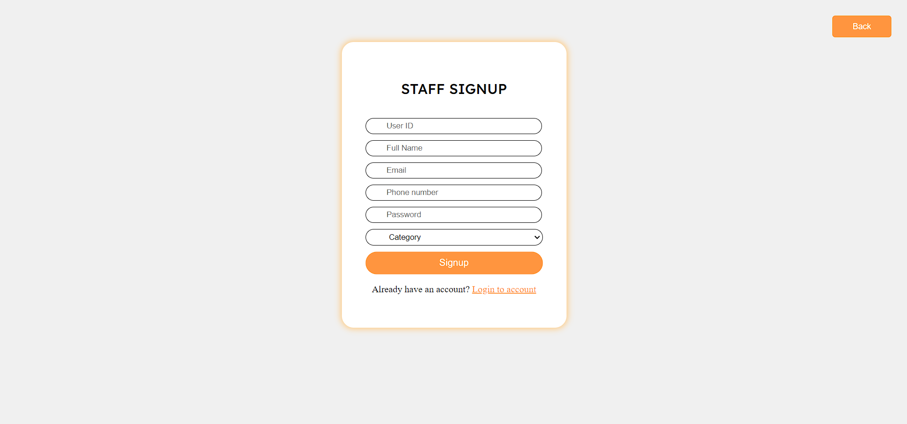

**Staff Dashboard:**
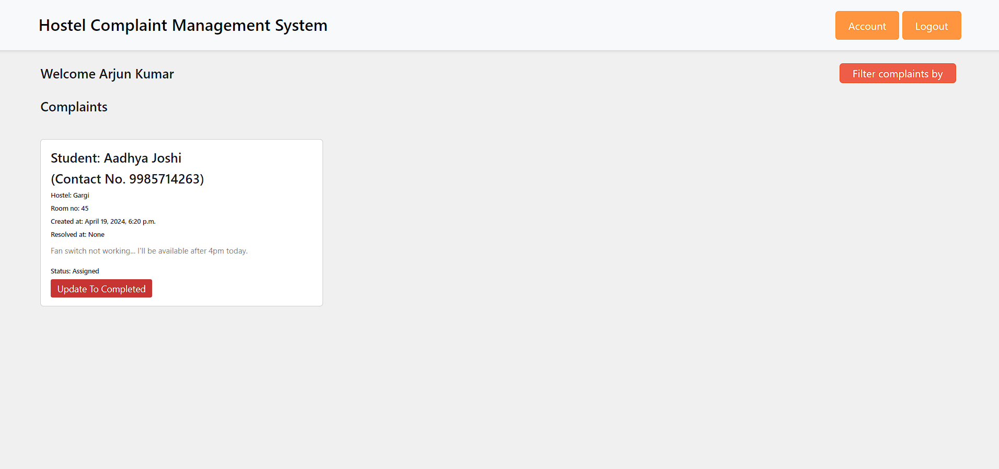

**Staff Dashboard after updating complaint status:**
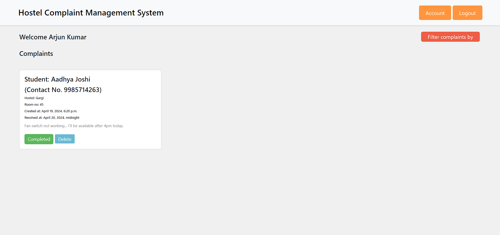

**Staff filter for complaints:**
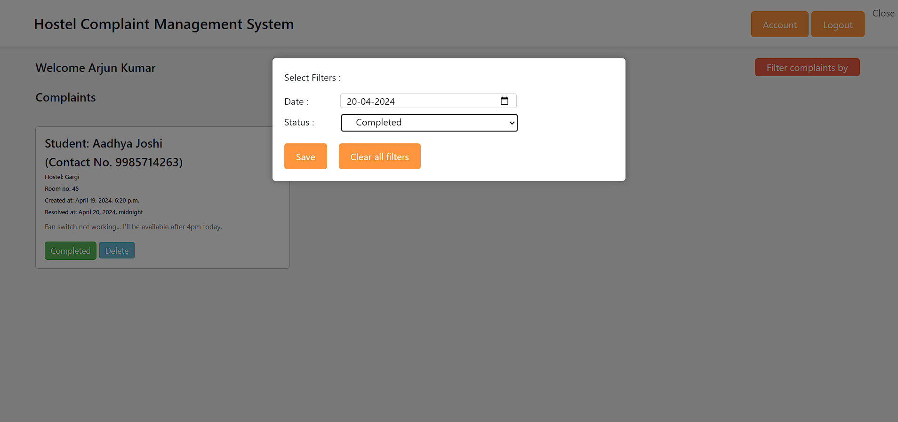

**Student dashboard after complaint completion:**
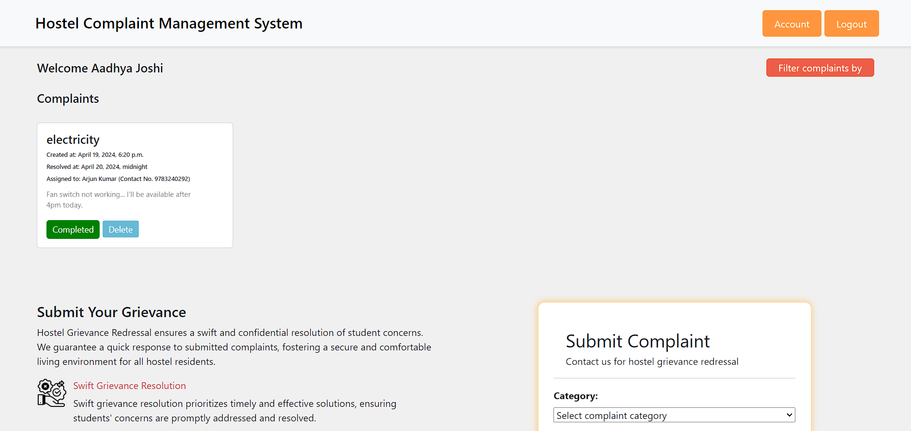

## Scope (Further improvements)
- Other complaint categories that can be added: Cleanliness & sanitation, Mess-related issues, Staff service issues etc.
- Feedback option can be added to student account which can affect staff rating.
- Caretakers can be added as intermediatery users for supervisory purposes.
- Prioritize grievances. 

